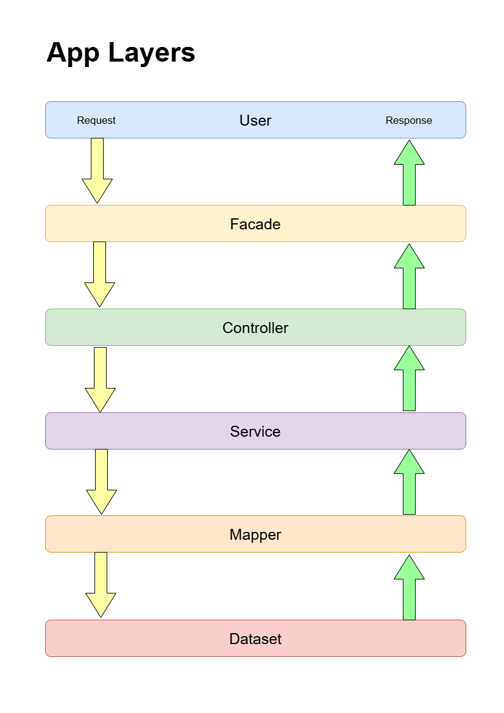

# Divar Entrance Test

This project is an implementation of the **Divar Entrance Test** using **Vanilla PHP** with a focus on:

- **Object-Oriented Programming (OOP)**
- **SOLID Principles**
- **Design Patterns**
- **Clean Architecture & Best Practices**

---

## 🛠️ Technologies Used

- PHP (Vanilla)
- Composer (for autoload)

---
## 🧱 App Layers And Request Life Cycle

---

## 🚀 Installation & Usage

To get started:

1. **Clone the repository**

   ```bash
   git clone git remote add origin https://github.com/esmaeelghasemi/php-divar-entrance-test.git
   cd php-divar-entrance-test
   ```

2. **Install dependencies**

   Make sure you have [Composer](https://getcomposer.org/) installed. Then run:

   ```bash
   composer install
   ```

3. **Run the application**

   You can use the built-in PHP server:

   ```bash
   php index.php
   ```

---

## 👤 Author

**Esmaeel Ghasemi**  
Full-stack developer | PHP & Laravel Expert  
[LinkedIn](https://www.linkedin.com/in/esmaeel-ghasemi-2139b3212/) • [GitHub](https://github.com/esmaeelghasemi).